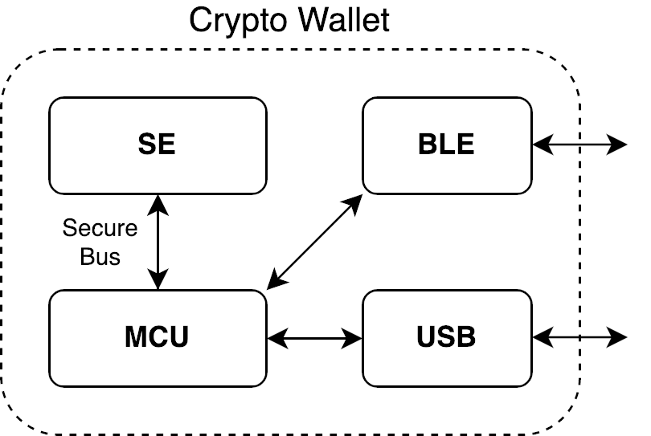

# ADF Usage Example to TM a Cryptowallet

We present a real-world case study where the **AttackDefense Framework (ADF)** is used to threat model a crypto wallet demostrating the framework's effectiveness in identifying a broad set of threats across various domains, including hardware, firmware, software, protocols, security and privacy. More details about the ADF are available in our [paper](https://dl.acm.org/doi/abs/10.1145/3698396).

## Introduction

Securing Internet of Things (IoT) devices and their lifecycles is essential in an increasingly interconnected world. The ADF provides a novel approach to threat modeling that addresses the complex security challenges posed by modern devices. ADF enables security practitioners to model threats across various domains, including hardware, firmware, software, protocols, lifecycles, and the interplay between security and privacy

Current threat modeling frameworks have limitations when it comes to securing embedded devices. They often overlook important domains like hardware and communication protocols and don't consider the entire product lifecycle.
We designed the ADF to address these limitations. It uses a flexible data structure called the **AttackDefense (AD) object** to represent threats comprehensively. The AD object includes details about the attack, potential defenses, and relevant information.
The ADF also provides automation tools that make analyzing and understanding threats easier. These tools can create different representations, such as lists and diagrams, to help identify and prioritize threats.
We show the effectiveness of the ADF with a crypto wallet case study. We show how to use the framework to threat model a device with heterogeneous components in different threat scenarios, e.g., hardware, software, and protocol threats.


## Cryptowallet overview

<div style="display: flex; flex-direction: column; align-items: center; background-color: lightgray; padding: 10px; margin-bottom: 20px;">
  
  <p style="margin-top: 5px; font-size: 14px; color: gray;">
    High level Crypto Wallet system model</p>
</div>

Imagine we are developing a new crypto wallet with the following requirements. The crypto wallet has a secure element (SE) connected to a general purpose microcontroller (MCU) through a secure bus. The SE handles sensitive operations such as key generation and transaction signing, while the MCU manages the other functionalities. The wallet uses Bluetooth Low Energy (BLE) to communicate with a companion application installed on a smartphone, and supports Fast IDentity Online (FIDO2) authentication mechanisms. The cryptowallet has one button to turn it on or off or to confirm actions through a keypress.
Before deploying it, it's essential to conduct a threat model exercise to identify and mitigate potential security and privacy risks. The ADF can help us achieve this.

We evaluated the ADF by using it to TM *seven orthogonal threat domains* for the crypto wallet:
- Physical Side-Channel and Fault Injection Threats: [side-channel-phy.yaml](https://github.com/francozappa/adf/blob/main/catalog/side-channel-phy.yaml)
- Micro architectural and Speculative Execution Threats:
  [microa.yaml](https://github.com/francozappa/adf/blob/main/catalog/microa.yaml)
- Pre-silicon Testing Threats:
  [presil.yaml](https://github.com/francozappa/adf/blob/main/catalog/presil.yaml)
- Physical Hardware Threats:
  [physical.yaml](https://github.com/francozappa/adf/blob/main/catalog/physical.yaml)
- FIDO2 Threats:
  [fido_device.yaml](https://github.com/francozappa/adf/blob/main/catalog/fido_device.yaml),
  [fido_solokey.yaml](https://github.com/francozappa/adf/blob/main/catalog/fido_solokey.yaml),
  [fido_system.yaml](https://github.com/francozappa/adf/blob/main/catalog/fido_solokey.yaml).
- BLE Protocol and Implementation Threats:
  [bt.yaml](https://github.com/francozappa/adf/blob/main/catalog/fido_solokey.yaml)


## BLE Protocol and Implementation Threats for the Cryptowallet

In the next sections we describe how we used the ADF to TM BLE protocol and
implementation threats. In our TM exercise we followed four phases:

1. **System and Attacker Modeling.**
    In this phase we build a detailed model of the system which includes components, interconnections, and security requirements. Then we define the potential attackers and their capabilities.

2. **Threat Identification.**
    In this phase we define the attack surface and identify the threats that can be applied. We point out the attacker model(s) and analyze their goal(s) as well as the techniques they might use.

3. **Threat Ranking.**
    This phase involves assessing the severity of the previously identified threats using risk scoring systems, such as the Common Vulnerability Scoring System (CVSS).

4. **Defense Strategy.**
    In this phase we develop a defense plan, outlining strategies to address the identified threats, eventually prioritizing or ignoring them according to their risk score.

The ADF offers automations to improve the System Model and Threat Identification phases when performing a threat modeling excercise.

<div style="display: flex; flex-direction: column; align-items: center; background-color: lightgray; padding: 10px; margin-bottom: 20px;">
  
  <p style="margin-top: 5px; font-size: 14px; color: gray;">
    High level ADF mapping to TM phases</p>
</div>

### System and Attacker Models (Phase 1)

The wallet uses BLE-for wireless communication with a companion application. This introduces potential threats at the protocol and implementation levels. Protocol-level threats focus on vulnerabilities within the BLE specification itself, such as attacks targeting the pairing process or exploiting weaknesses in key derivation mechanisms. Implementation-level threats arose from specific vulnerabilities in the software or hardware implementation of BLE on the crypto wallet. These could include buffer overflows, memory corruption issues, or side-channel vulnerabilities that could leak sensitive information.


The wallet uses the standard BLE security mechanisms (i.e., pairing and session establishment). All the communication are encrypted, since the device does not possess any I/O capabilities we cannot perform user-assisted authentication, therefore the pairing protocol will use the JustWorks (JW) association method (i.e., unauthenticated pairing).
For the pairing protocol we will use the Secure Connections (SC) mode, which employs Elliptic Curve Diffie Hellman (ECDH) key exchange and uses other modern and secure crypto primitives, such as AES CCM and AES-based Key Derivation Functions (KDF). Using the "Analyze" function we can exclude ADs related to the absence of Link Layer Security, or anything related to custom Application Layer protocols.
Additionally, we can filter out only the threats related to JW association.


The attacker has Dolev-Yao capabilities (e.g., MitM) and BLE proximity but not physical access to either the smartphone or the cryptowallet. The attacker is not assumed to be capable of compromising the smartphone nor the application.
The attacker can eavesdrop, intercept, and modify legitimate BLE communications.
We assume to have a secure BLE stack implementation and we focus only on protocol-level threats.

<!-- **Just Works:** Your device's lack of I/O dictates using the JW authentication method. This limits the attack surface but exposes it to Machine-in-the-Middle scenarios. You can eliminate association-related threats that do not apply to JW using the "Analyze" function. For instance, attacks exploiting vulnerabilities on passkey entry would not be relevant. -->

Based on our assumptions we set **Confidentiality** and **Authenticity** requirements for the BLE communication.

### Threats Enumeration (Phase 2)

To enumerate the threats we rely on the `analyze` module with the following functions. In this case we want to show them in a three organized by surfaces.

```python
# Load the Bluetooth threats
bt_ads = get_dataframe(Path("toolkit/yaml/bt.yaml"))

# Keep only BLE Pairing and Session Establishment related threats
ble_ads = get_set(bt_ads, "surf", "BLE, SMP, Pairing")
ble_ads = pd.concat([ble_ads, get_set(bt_ads, "surf", "BLE, Session")])

# Keep only protocol-level without dual-mode requirements
ble_ads = get_set(ble_ads, "tag", "Protocol, not dual-mode")

# Show a surface tree
ble_pro_tree = get_surf_tree(ble_ads)
ble_pro_tree.view()

# Show nicely formatted attacks and defenses
get_defenses(ble_ads)
```

The result gives a high level view of the threats that may be applicable to our device.


The ADs related to Bluetooth are contained in the `bt.yaml` file. The following is the `crackle` AD:

```yaml
crackle_ble:
  a: BLE Key Derivation (CRACKLE)
  d:
    Do not use custom Key Exchange Protocol: [Use standard DH]
  year: 2013
  surf: [BLE, SMP, Legacy pairing]
  vect: [Key brute force]
  model: [Proximity, Eavesdropper]
  tag: [Protocol]
```

- The `a` field indicates the name of the threat.
- The `d` field represent a list of defenses and mitigations. On the left a high level policy, on the right the actual recommendation.
- The `surf` field represent a list of surfaces starting from the broadest one, to end with the more specific one.
- The `vect` field indicates one or more vector that the attack makes use of.
- The `model` field indicates the attacker model(s).
- The `tag` field indicates any extra keyword that can add useful information to the attack.


<!-- **KNOB Attack:** These attacks target the entropy negotiation phase of pairing, potentially allowing an attacker to brute force the encryption key. The "knob_ble" AD in your catalog describes this attack in detail, providing information on its surface, vectors, and mitigation strategies.

**Passive Eavesdropping:** While SC encrypts communication, a passive attacker could still potentially eavesdrop on BLE traffic and gather information about the device and its usage patterns. -->


### Threats Scoring and Defense Strategy (Phases 3 and 4)

In this case we combine the scoring and defense strategy phases since we rely on static score from the NIST CVSS 3.0. The `det_defenses` function will output a well formatted list of attacks with their associated defenses and mitigations. The attacks are sorted according to their risk score where available.

```yaml
knob_ble:
    Attack: Key Negotiation of Bluetooth (KNOB) on BLE
    Risk: [8.1]
    Defenses:
        - Mutually authenticated entropy negotiation:
            - Integrity protect entropy negotiation with the pairing key
        - Block entropy negotiation:
            - Use Secure Connections Only (SCO) Mode

invcurve_ble:
    Attack: Invalid Curve Attack
    Risk: [6.8]
    Defenses:
        - Public key validation:
            - Verify public key satisfies the curve equation

blesa_ble:
    Attack: BLE reconnection spoofing
    Risk: [6.5]
    Defenses:
        - Securing reconnection:
            - Abort on reconnection authentication failure

pairing_method_confusion_ble:
    Attack: Method confusion attack
    Risk: [6.3]
    Defenses:
        - Enforce specific authentication method:
            - Use OOB authentication
        - User interface fix:
            - Display authentication method warning to the user
        - Authentication method validation:
            - Embed information about the authentication method in the authentication data itself to make them distinguishable

injectable:
    Attack: PHY packet injection
    Risk: [5.3]
    Defenses:
        - Enable BLE encryption:

bluemirror_ble:
    Attack: Reflection attack on passkey entry
    Risk: [4.2]
    Defenses:
        - Restrict accepted public keys:
            - Abort pairing if the remote public key is identical to the device's local one.

nino_ble:
    Attack: MitM on BLE SSP
    Risk: nan
    Defenses:
        - Out of band pairing:
            - Use NFC as OOB channel
```

With the identified threats, mitigations, and defenses, a security expert has all the indications needed to secure its device against the threats.

**Mitigating KNOB:** The "knob_ble" AD suggests implementing mutual authentication during entropy negotiation or disallowing entropy values lower than 16 bits. These measures effectively prevent an attacker from manipulating the entropy level. This can be done by forcing the Secure Connections Only (SCO) mode or manually forcing the entropy to 16 bytes when compiling the BLE stack. This would break compatibility with very old devices trying to use a key with lower entropy, however it can be addressed user-side by specifying the BLE version compatibility.

**Mitigating NiNO**: The "nino_ble" AD suggest using NFC and rely on OOB authentication, our CryptoWallet does not have NFC capabilites but it could be a viable solution and would also protect against the **Pairing Method Confusion** attack.

**Countering Passive Eavesdropping:** Consider using additional techniques like frequency hopping or randomized MAC addresses to make it more challenging for an attacker to track the device and its communication.

**Injectable** is already fixed by the usage of Link Layer encryption.

**Mitigating BLESA**: The BLESA threat applies to a BLE Central devices, however, since our Crypto Wallet is a Peripheral, we can fix it by disabling Central capabilities in the BLE stack when compiling it.
